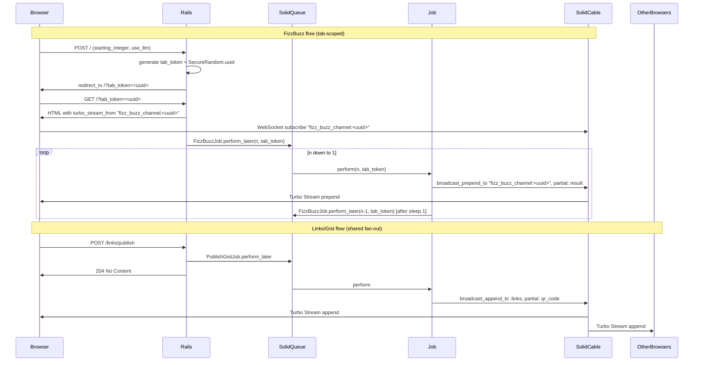
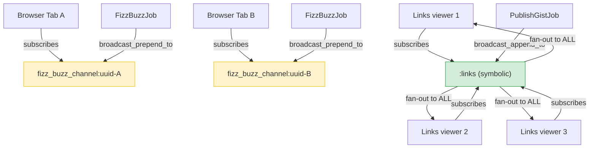

# Existing Turbo Patterns — Research

**Issue #93**: Add an anonymous audience survey with live-updating results dashboard.

## Summary of findings

The app uses **Turbo Streams exclusively through `Turbo::StreamsChannel` class methods** — there are no custom ActionCable channel classes (`app/channels/` is empty beyond Rails defaults). All live updates are triggered from Active Jobs, never directly from controllers.

Two broadcast patterns exist:

1. **Tab-scoped job broadcast** (`FizzBuzzJob`, `LLMFizzBuzzJob`): Each browser tab gets a unique UUID (`tab_token`), passed as a query param in the redirect URL and embedded in the view's `turbo_stream_from` tag. Jobs prepend partials to `"fizz_buzz_channel:#{tab_token}"`. Strictly per-session — no fan-out.

2. **Global job broadcast** (`PublishGistJob`): After creating a Gist, the job appends a QR code partial to the symbolic `:links` channel. All viewers of `/links` receive it simultaneously. This is the only existing fan-out (shared) broadcast — the direct precedent for the survey dashboard.

**solid_cable 4.0.0** backs production WebSockets via a dedicated SQLite database (`storage/production_cable.sqlite3`, polling every 0.1 seconds). Development uses the in-process `async` adapter.

**For the survey aggregate dashboard**, the job-based fan-out pattern (Option A) is the right fit: after each `SurveyResponse` save, enqueue `BroadcastSurveyResultsJob` which calls `Turbo::StreamsChannel.broadcast_replace_to("survey_results:#{survey_id}", ...)`. All results-page viewers subscribed to that channel see the dashboard element replaced with fresh aggregate data. No new cable infrastructure is needed.

---

## Table of contents

- [Broadcast Mechanism](./broadcast-mechanism.md) — how `broadcast_prepend_to`, `broadcast_append_to`, and `broadcast_replace_to` are used; channel naming conventions; partial rendering; absence of custom ActionCable channels
- [Aggregate Broadcast Options](./aggregate-broadcast-options.md) — three options evaluated (job-based, controller-inline, scheduled polling); gaps identified; recommended implementation blueprint

---

## Current broadcast data flow

### Channel-scoping summary

The green node (`:links`) is the fan-out pattern the survey dashboard should replicate, using `"survey_results:#{survey.id}"` as its channel name.

---

## Key version information

| Gem | Version |
|---|---|
| rails | ~> 8.1.3 |
| turbo-rails | 2.0.23 |
| actioncable | 8.1.3 |
| solid_cable | 4.0.0 |
| solid_queue | (production job backend) |
| sqlite3 | >= 2.1 |

## Key file paths

| File | Relevance |
|---|---|
| `app/jobs/fizz_buzz_job.rb` | Tab-scoped `broadcast_prepend_to` pattern |
| `app/jobs/llm_fizz_buzz_job.rb` | Identical pattern with LLM computation |
| `app/jobs/publish_gist_job.rb` | Both per-record (`broadcast_replace_to`) and shared (`:links`) patterns |
| `app/views/fizz_buzz/start.html.erb` | `turbo_stream_from "fizz_buzz_channel:#{params[:tab_token]}"` subscription |
| `app/views/links/index.html.erb` | `turbo_stream_from :links` shared subscription |
| `config/cable.yml` | `async` (dev/test), `solid_cable` (production) |
| `db/cable_schema.rb` | `solid_cable_messages` table with channel + payload columns |
| `config/database.yml` | `cable` DB at `storage/production_cable.sqlite3` |
