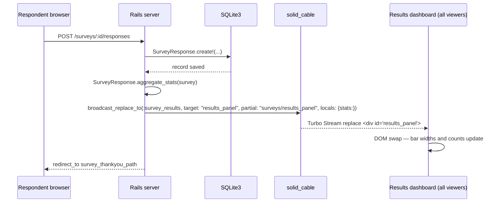

# Research: Live-Results Dashboard — Issue #93

## Recommendation

Use **Turbo Stream `broadcast_replace_to` called synchronously from the
controller** (or a thin after-create callback) after every `SurveyResponse`
save. This is the simplest, most direct fit with the existing app patterns
(see `PublishGistJob` and `FizzBuzzJob`) and delivers sub-second refresh to
every connected results-page viewer without polling or additional gems.

Channel name: the literal symbol `:survey_results` (matches the `:links`
symbol pattern already in use).

## Table of Contents

- [update-strategies.md](update-strategies.md) — Compares broadcast-from-controller, async-job broadcast, meta-refresh, and Turbo Frame polling
- [results-ui-design.md](results-ui-design.md) — Dashboard layout, aggregation query structure, partial skeleton, and CSS additions

## Update Flow

## Key Findings at a Glance

| Concern | Decision |
|---|---|
| Update mechanism | `Turbo::StreamsChannel.broadcast_replace_to(:survey_results, ...)` in controller |
| Channel | `:survey_results` (symbol, same style as `:links`) |
| Target DOM id | `results_panel` |
| Aggregation | `GROUP BY question_id, answer_value` SQL + in-Ruby percent calc |
| Dashboard layout | Single-column, question cards with inline CSS bar charts |
| CSS additions | `--bar-fill` CSS var on `` width; large `font-size` tokens for projector |
| No gems needed | Pure Hotwire; no charting library |
