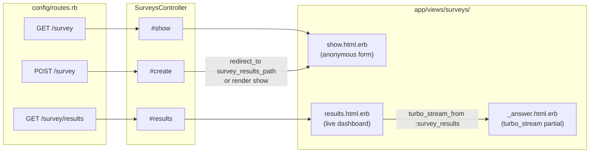

# Rails Routing & Controller Design — Issue #93 Survey Feature

## Recommendation Summary

Use `resource :survey` (singular) with a single `SurveysController` exposing three actions: `show` (GET form), `create` (POST submission), and `results` (GET live dashboard). Add the `results` action as a `get :results, on: :member` override on the singular resource, or simply as a standalone collection route. No authentication changes needed — `protect_from_forgery` works transparently with public forms. The results page uses `turbo_stream_from` in the view, consistent with how FizzBuzz and Links pages already do live updates.

## Table of Contents

- [Route Options](route-options.md) — Compares three route designs; argues for singular `resource :survey`
- [Controller Design](controller-design.md) — One vs two controllers; Turbo Stream pattern; CSRF safety; test structure

## Route → Controller → View Diagram

**Named helpers produced by the recommended route declaration:**

| Helper | HTTP method | Path |
|---|---|---|
| `survey_path` | GET | `/survey` |
| `survey_path` | POST | `/survey` |
| `results_survey_path` | GET | `/survey/results` |

All three URLs are short enough to fit comfortably in a QR code.
