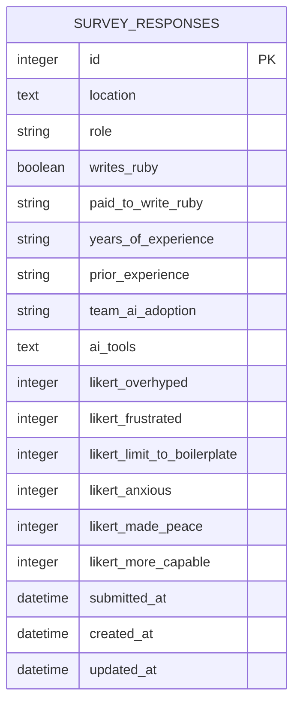

# Survey Schema Research

**Feature:** Issue #93 — Anonymous audience survey with live-results dashboard
**Research topic:** Database schema for storing survey responses

---

## Recommendation Summary

Use a **single flat `survey_responses` table** with:

- **Enum-like fields** stored as `string` columns with Rails `enum` macro (matching app convention from existing `eval_type` string columns in `ruby_llm_evals_*` tables)
- **Multi-select AI tools** stored as a **serialized JSON array** in a single `text` column (`serialize :ai_tools, coder: JSON`) — simplest for SQLite, avoids a join table for a small fixed-cardinality field
- **Likert items** stored as **6 separate `integer` columns** (one per statement) — enables per-statement AVG in a single SQL expression without unpivoting; column names self-document which statement they belong to
- **Location** stored as plain `text` (free-form, no enum)
- **`submitted_at` timestamp** for ordering and rate-limiting without exposing identity

No join tables are needed. The entire response is one row; aggregation queries are straightforward `GROUP BY` or `AVG` on the flat columns.

---

## Table of Contents

- [Schema options and trade-off analysis](schema-options.md)
  - Approach A: Flat table
  - Approach B: Normalized with join table
  - Multi-select storage options
  - Likert storage options
  - Enum pattern conventions in this app
- [Aggregation queries](aggregation-queries.md)
  - Count by role
  - Ruby experience breakdown
  - Average Likert score per statement
  - AI tools frequency ranking
- [Migration sketch](#migration-sketch) (below)

---

## Mermaid ERD



No foreign-key relationships. All data for one survey response lives in one row.

---

## Migration Sketch

```ruby
class CreateSurveyResponses < ActiveRecord::Migration[8.1]
  def change
    create_table :survey_responses do |t|
      # Q1 — Location (free text)
      t.text :location

      # Q2 — Role
      t.string :role, null: false

      # Q3 — Writes Ruby?
      t.boolean :writes_ruby, null: false

      # Q4 — Paid to write Ruby?
      t.string :paid_to_write_ruby, null: false

      # Q5 — Years of Ruby/Rails experience
      t.string :years_of_experience, null: false

      # Q6 — Prior programming experience
      t.string :prior_experience, null: false

      # Q7 — Team AI adoption posture
      t.string :team_ai_adoption, null: false

      # Q8 — AI tools used (serialized JSON array of strings)
      t.text :ai_tools, null: false, default: "[]"

      # Q9 — Likert items (1 = strongly disagree, 5 = strongly agree)
      t.integer :likert_overhyped           # "AI coding tools are overhyped..."
      t.integer :likert_frustrated          # "I feel frustrated by the growing expectation..."
      t.integer :likert_limit_to_boilerplate  # "I intentionally limit AI to boilerplate tasks..."
      t.integer :likert_anxious             # "The pace of AI advancement makes me anxious..."
      t.integer :likert_made_peace          # "AI tools are here to stay and I've made peace..."
      t.integer :likert_more_capable        # "I've adapted how I work and AI genuinely makes me more capable"

      t.datetime :submitted_at, null: false

      t.timestamps
    end

    add_index :survey_responses, :role
    add_index :survey_responses, :submitted_at
  end
end
```
