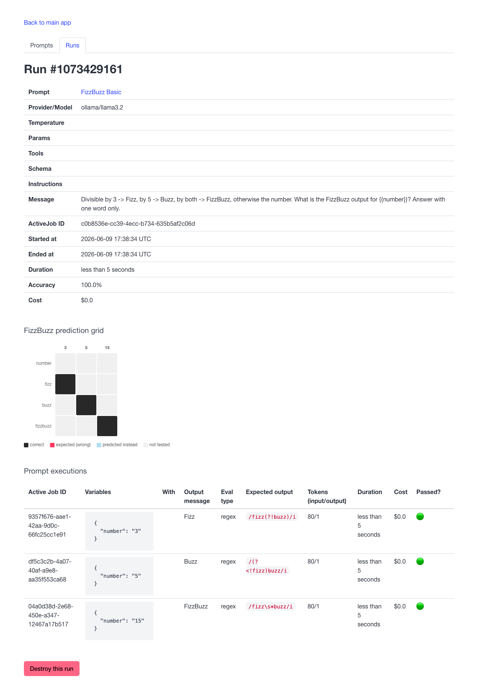
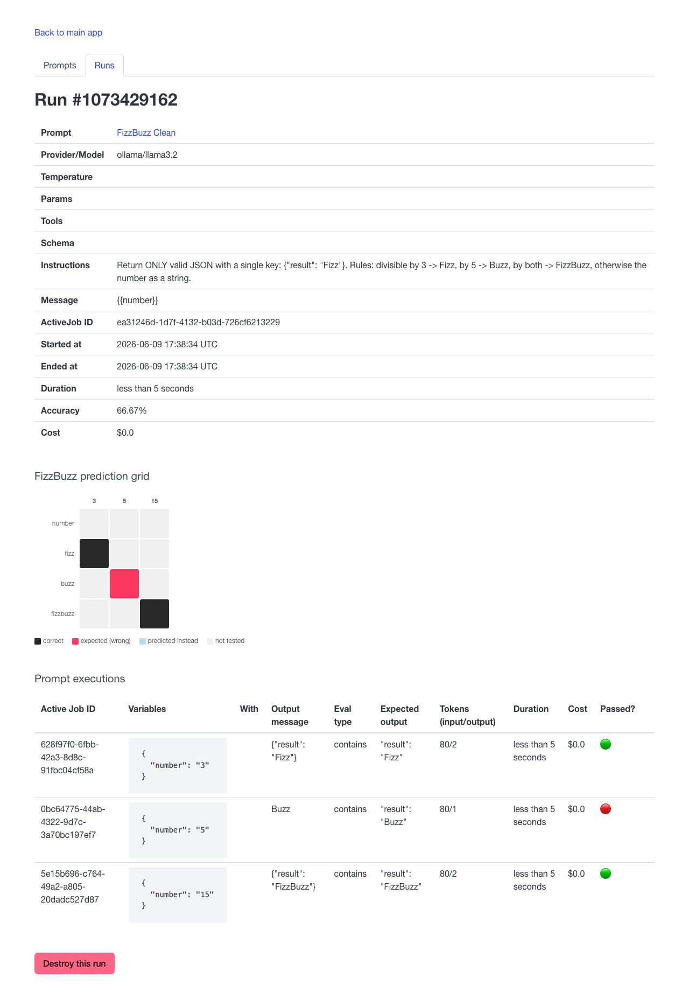
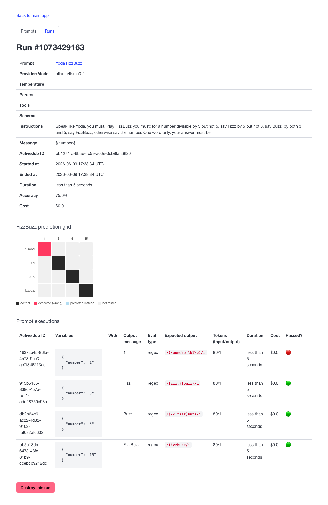

# FizzBuzz Eval Run Grids

Each eval prompt is tested against a set of sample inputs. When a run
completes, the run detail page shows a prediction grid — a 4×N table
inspired by [Joel Grus's pydata-chicago FizzBuzz visualizations][tf-ref] —
that makes pass/fail patterns immediately visible.

## How to read the grid

| Color | Meaning |
|---|---|
| ■ near-black | Model predicted the correct class |
| ■ red | Expected this class, but the model didn't produce it |
| ■ light blue | What the model actually predicted instead (when wrong) |
| □ light gray | This (number, class) combination wasn't tested in this run |

Rows are the four output classes (`number`, `fizz`, `buzz`, `fizzbuzz`).
Columns are the input numbers tested, sorted ascending. A perfectly correct
model produces a single dark diagonal — one lit cell per column in the row
matching the correct class for that number.

[tf-ref]: https://github.com/joelgrus/fizz-buzz-tensorflow/blob/d14b8b56956c3e7e13ff219cf580849adf6788bd/pydata-chicago/plots.py

---

<details>
<summary><strong>FizzBuzz Eval</strong> — plain-language instructions, one-word answer</summary>

**Instructions**

> Evaluate FizzBuzz for the given number. Return exactly one word:
> 'FizzBuzz' if divisible by both 3 and 5, 'Fizz' if divisible by 3 only,
> 'Buzz' if divisible by 5 only, or the number itself otherwise.

**Message template**

```
{{number}}
```

**Samples**

| number | eval type | expected output |
|--------|-----------|-----------------|
| 3 | contains | `Fizz` |
| 5 | contains | `Buzz` |
| 15 | contains | `FizzBuzz` |

**Run shown** — ollama/llama3.2, accuracy 66.67%

The model answered `Fizz` for both 3 and 5. The grid shows:
- **3 → fizz**: dark (correct)
- **5 → buzz**: red (expected Buzz, model said Fizz); **5 → fizz**: light blue (what it predicted instead)
- **15 → fizzbuzz**: dark (correct)


</details>

---

<details>
<summary><strong>FizzBuzz Basic</strong> — rules embedded in the message, no system instructions</summary>

**Instructions**

*(none)*

**Message template**

```
Divisible by 3 -> Fizz, by 5 -> Buzz, by both -> FizzBuzz, otherwise the
number. What is the FizzBuzz output for {{number}}? Answer with one word only.
```

**Samples**

| number | eval type | expected output |
|--------|-----------|-----------------|
| 3 | regex | `/fizz(?!buzz)/i` — Fizz but not FizzBuzz |
| 5 | regex | `/(?<!fizz)buzz/i` — Buzz but not FizzBuzz |
| 15 | regex | `/fizz\s*buzz/i` — FizzBuzz |

The regex patterns use negative lookahead/lookbehind to reject a raw
`FizzBuzz` answer when only `Fizz` or `Buzz` was expected.

**Run shown** — ollama/llama3.2, accuracy 100%

All three samples passed. The grid shows a clean diagonal of dark cells.



</details>

---

<details>
<summary><strong>FizzBuzz Clean</strong> — structured JSON output</summary>

**Instructions**

> Return ONLY valid JSON with a single key: {"result": "Fizz"}. Rules:
> divisible by 3 -> Fizz, by 5 -> Buzz, by both -> FizzBuzz, otherwise
> the number as a string.

**Message template**

```
{{number}}
```

**Samples**

| number | eval type | expected output |
|--------|-----------|-----------------|
| 3 | contains | `"result": "Fizz"` |
| 5 | contains | `"result": "Buzz"` |
| 15 | contains | `"result": "FizzBuzz"` |

The `contains` check looks for the key-value substring anywhere in the
response, which tolerates minor JSON formatting variation while still
requiring the wrapper.

**Run shown** — ollama/llama3.2, accuracy 66.67%

The model returned raw `Buzz` for number 5 without the JSON wrapper. The
grid shows:
- **3 → fizz**: dark (correct JSON)
- **5 → buzz**: red (expected JSON-wrapped Buzz, got plain `Buzz`)
- **15 → fizzbuzz**: dark (correct JSON)



</details>

---

<details>
<summary><strong>Yoda FizzBuzz</strong> — creative persona, extra sample for plain numbers</summary>

**Instructions**

> Speak like Yoda, you must. Play FizzBuzz you must: for a number
> divisible by 3 but not 5, say Fizz; by 5 but not 3, say Buzz; by both
> 3 and 5, say FizzBuzz; otherwise say the number. One word only, your
> answer must be.

**Message template**

```
{{number}}
```

**Samples**

| number | eval type | expected output |
|--------|-----------|-----------------|
| 1 | regex | `/(\bone\b\|\b1\b)/i` — the digit or the word "one" |
| 3 | regex | `/fizz(?!buzz)/i` |
| 5 | regex | `/(?<!fizz)buzz/i` |
| 15 | regex | `/fizzbuzz/i` |

Number 1 is the only sample that tests the plain-number path. The regex
accepts either the digit `1` or the word `one`, anticipating that a
Yoda-persona model might spell out small numbers.

**Run shown** — ollama/llama3.2, accuracy 75%

The model returned `1` for number 1, which failed the regex (the eval
flagged it as not matching the expected pattern). Fizz, Buzz, and FizzBuzz
all passed. The grid shows:
- **1 → number**: red (failed)
- **3 → fizz**, **5 → buzz**, **15 → fizzbuzz**: dark (correct)



</details>
