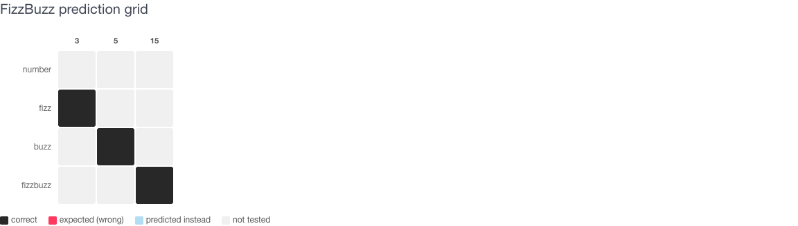
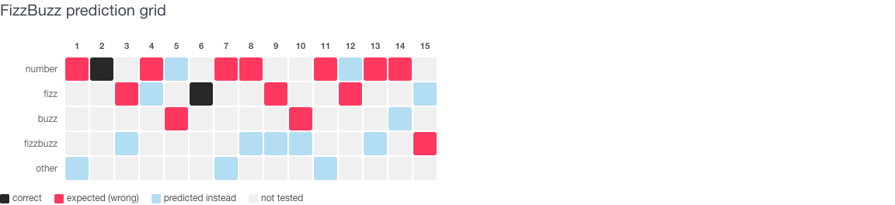
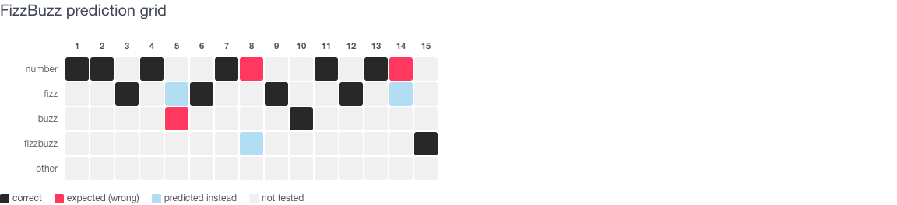
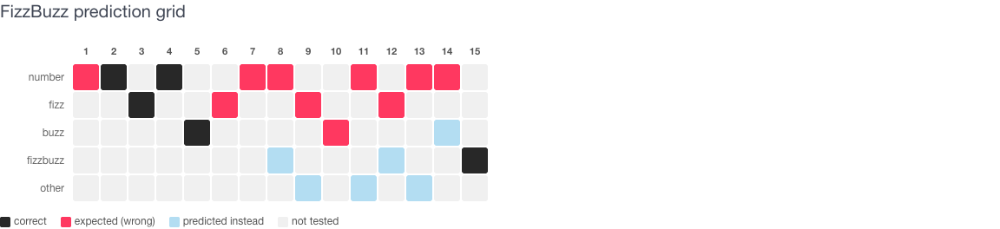
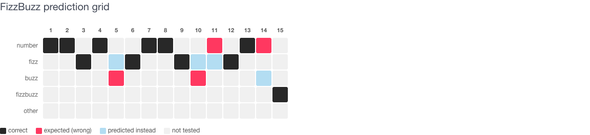

# FizzBuzz eval run grids

Each grid shows how a model performed across the FizzBuzz test cases for one
eval run. Columns are the input numbers tested; rows are the four output
classes. A perfect run looks like this:



A dark cell on the diagonal means the model predicted the right class for
that number. Red means the expected class was wrong; light blue marks what the
model predicted instead.

---

## FizzBuzz Basic

<details>
<summary>Prompt &amp; samples</summary>

**Message** (no system instructions)
```
Is {{number}} a FizzBuzz number? Answer with FizzBuzz, Fizz, Buzz or the number if not.
```

| number | expected |
|--------|----------|
| 1 | `/\b1\b/i` |
| 2 | `/\b2\b/i` |
| 3 | `/fizz(?!buzz)/i` |
| 4 | `/\b4\b/i` |
| 5 | `/(?<!fizz)buzz/i` |
| 6 | `/fizz(?!buzz)/i` |
| 7 | `/\b7\b/i` |
| 8 | `/\b8\b/i` |
| 9 | `/fizz(?!buzz)/i` |
| 10 | `/(?<!fizz)buzz/i` |
| 11 | `/\b11\b/i` |
| 12 | `/fizz(?!buzz)/i` |
| 13 | `/\b13\b/i` |
| 14 | `/\b14\b/i` |
| 15 | `/fizz\s*buzz/i` |

</details>



---

## FizzBuzz Eval

<details>
<summary>Prompt &amp; samples</summary>

**System instructions**
```
Evaluate FizzBuzz for the given number. Return exactly one word: 'FizzBuzz'
if divisible by both 3 and 5, 'Fizz' if divisible by 3 only, 'Buzz' if
divisible by 5 only, or the number itself otherwise.
```

**Message**
```
{{number}}
```

| number | expected |
|--------|----------|
| 1 | `1` |
| 2 | `2` |
| 3 | `Fizz` |
| 4 | `4` |
| 5 | `Buzz` |
| 6 | `Fizz` |
| 7 | `7` |
| 8 | `8` |
| 9 | `Fizz` |
| 10 | `Buzz` |
| 11 | `11` |
| 12 | `Fizz` |
| 13 | `13` |
| 14 | `14` |
| 15 | `FizzBuzz` |

</details>



---

## FizzBuzz Clean

<details>
<summary>Prompt &amp; samples</summary>

**System instructions**
```
Return ONLY valid JSON with a single key: {"result": "Fizz"}. Rules:
divisible by 3 -> Fizz, by 5 -> Buzz, by both -> FizzBuzz, otherwise the
number as a string.
```

**Message**
```
{{number}}
```

| number | expected |
|--------|----------|
| 1 | `"result": "1"` |
| 2 | `"result": "2"` |
| 3 | `"result": "Fizz"` |
| 4 | `"result": "4"` |
| 5 | `"result": "Buzz"` |
| 6 | `"result": "Fizz"` |
| 7 | `"result": "7"` |
| 8 | `"result": "8"` |
| 9 | `"result": "Fizz"` |
| 10 | `"result": "Buzz"` |
| 11 | `"result": "11"` |
| 12 | `"result": "Fizz"` |
| 13 | `"result": "13"` |
| 14 | `"result": "14"` |
| 15 | `"result": "FizzBuzz"` |

</details>



---

## Yoda FizzBuzz

<details>
<summary>Prompt &amp; samples</summary>

**System instructions**
```
Speak like Yoda, you must. Play FizzBuzz you must: for a number divisible
by 3 but not 5, say Fizz; by 5 but not 3, say Buzz; by both 3 and 5, say
FizzBuzz; otherwise say the number. One word only, your answer must be.
```

**Message**
```
{{number}}
```

| number | expected |
|--------|----------|
| 1 | `/(\bone\b\|\b1\b)/i` |
| 2 | `/(\btwo\b\|\b2\b)/i` |
| 3 | `/fizz(?!buzz)/i` |
| 4 | `/(\bfour\b\|\b4\b)/i` |
| 5 | `/(?<!fizz)buzz/i` |
| 6 | `/fizz(?!buzz)/i` |
| 7 | `/(\bseven\b\|\b7\b)/i` |
| 8 | `/(\beight\b\|\b8\b)/i` |
| 9 | `/fizz(?!buzz)/i` |
| 10 | `/(?<!fizz)buzz/i` |
| 11 | `/(\beleven\b\|\b11\b)/i` |
| 12 | `/fizz(?!buzz)/i` |
| 13 | `/(\bthirteen\b\|\b13\b)/i` |
| 14 | `/(\bfourteen\b\|\b14\b)/i` |
| 15 | `/fizzbuzz/i` |

</details>


