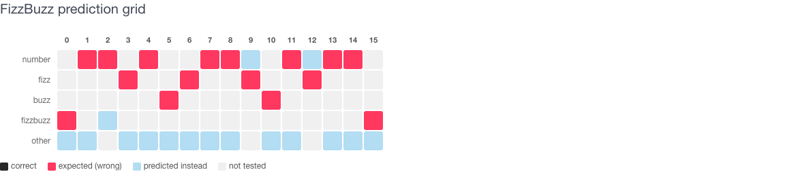
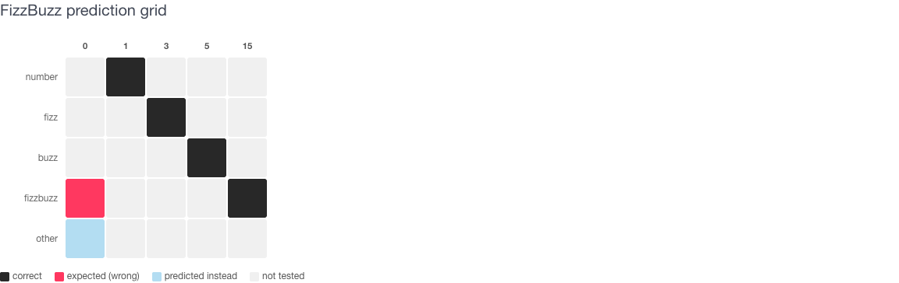
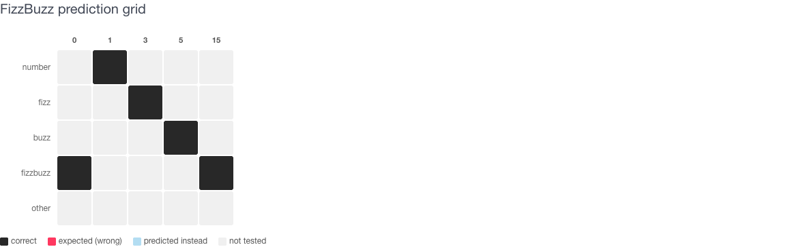
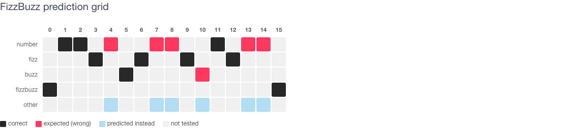
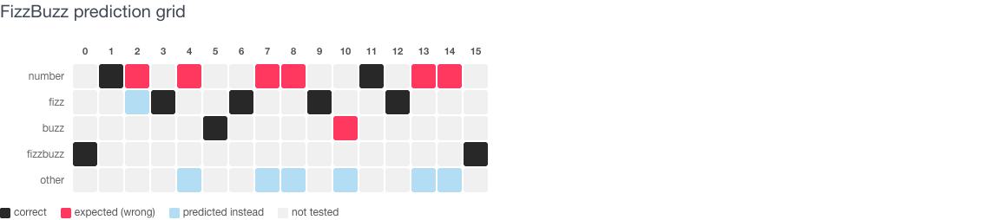
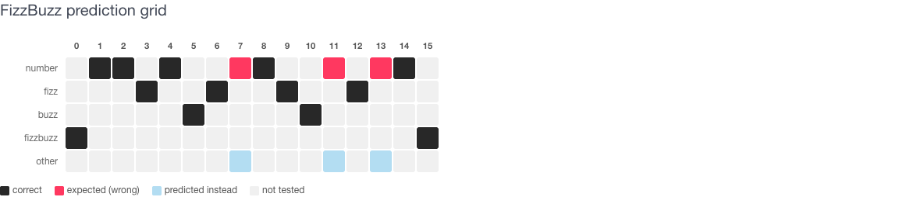
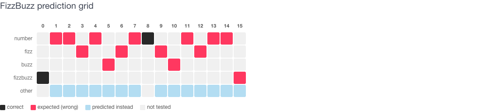
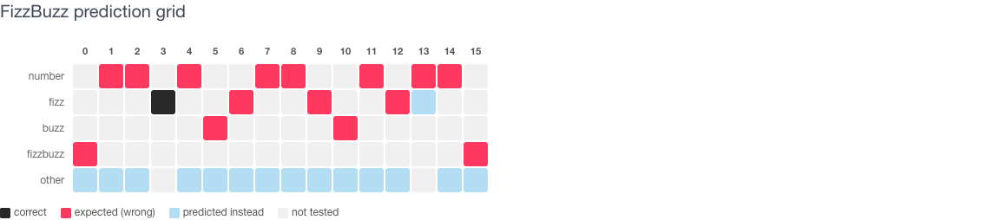
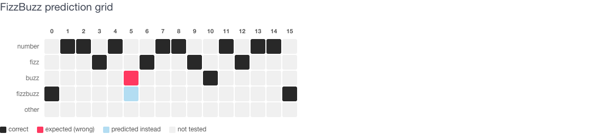

# FizzBuzz Basic — prompt hill climb

Starting from a poor-performing prompt, iteratively improving it by watching
what the model gets wrong and tightening the instruction.

**Model:** ollama/llama3.2  
**Pilot samples:** 1, 3, 5, 15, and an invalid input ("hello")  
**Full suite:** 1–15 plus invalid ("hello")  
**Grid columns:** 0 = invalid input ("hello".to_i → 0), then 1–15

---

## Baseline: FizzBuzz Basic (0%)

```
Is {{number}} a FizzBuzz number? Answer FizzBuzz, Fizz, Buzz, or the number.
```

Run on 16 samples (1–15 plus invalid). The question framing ("Is X a FizzBuzz
number?") biases the model toward always answering "FizzBuzz". 0 out of 16 pass.



**What went wrong:** The model treats "Is N a FizzBuzz number?" as a yes/no
question. No rules are given — the model has to recall FizzBuzz from training
data under a confusing framing.

---

## v2: Inline rules, message-only (20% — pilot)

```
FizzBuzz for {{number}}: answer FizzBuzz if divisible by 3 and 5,
Fizz if by 3 only, Buzz if by 5 only, or the number itself. One word.
```

Rules embedded in the user message. No system prompt. 1/5 on pilot — only 15
passes.


**What went wrong:** Packing rules into the user message isn't enough. Without
a system prompt, the model ignores the one-word constraint.

---

## v3: System instructions with rules (60% — pilot)

```
instructions: "Play FizzBuzz. For multiples of 3 say Fizz, multiples of 5
say Buzz, multiples of both say FizzBuzz, otherwise say the number.
One word only."
message: "{{number}}"
```

Rules moved to system instructions. 3/5 on pilot (Fizz, Buzz, FizzBuzz
correct; 1 returned "One", "hello" returned "Fizz").


**What changed:** Moving rules to the system prompt is the single largest
improvement. Fizz/Buzz/FizzBuzz are now reliable; plain numbers and invalid
inputs still fail.

---

## v4: Oracle framing + "as digits" (80% — pilot)

```
instructions: "You are a FizzBuzz oracle. Given a number respond with
exactly one word: 'FizzBuzz' if divisible by both 3 and 5, 'Fizz' if
divisible by 3 only, 'Buzz' if divisible by 5 only, or the number as
digits if neither. No explanation or extra text."
message: "{{number}}"
```

4/5 on pilot (1, 3, 5, 15 correct; "hello" returned "Error").



**What changed:** "As digits" fixed the "One" failure. Invalid inputs still
trigger an error response instead of echoing back.

---

## Expanding to the full suite (v5–v12)

From v5 onward each iteration was evaluated against all 16 samples (1–15
plus invalid). The goal: 16/16.

| Version | Change | Result | Note |
|---------|--------|--------|------|
| v5 | Add "echo non-numbers unchanged" rule | 4/5 pilot; 4/16 inferred | Fixed "hello", broke 5 → "FizzBuzz" |
| v6 | Add ONLY/examples for divisibility | 4/5 pilot | Fixed 5, broke "hello" → "error" |
| v7 | Combine: examples + echo non-digits | 5/5 pilot; **14/16 full** | 4 → "Four", 14 → "Fourteen" |
| v8 | "Echo input as-is" for all non-FizzBuzz | 13/16 | Regression: 10 and 14 got "FizzBuzz" |
| v9 | "Arabic numeral — never the word" | 14/16 | 8 → "4", 13 → "FizzBuzz" |
| v10 | Inline examples with `→` arrows | 15/16 | Arrow leaked into output: 2 → ">>" |
| v11 | Examples with `:` separator | **15/16** | 7 → "Fizz" (random noise) |
| v12 | Minimal one-sentence instruction | 6/16 | Regression — too sparse |

### v5 — pilot grid



### v6 — pilot grid


### v7 — first full-suite run



### v8 — echo regression



### v9 — Arabic numeral fix



### v10 — arrow examples (leaked into output)



### v12 — minimal instruction (regression)



---

## Best result: FizzBuzz Basic v11 (93.75%)

```
instructions: "You are a FizzBuzz oracle. Reply with exactly one token —
no explanation.
Rules:
- FizzBuzz if divisible by both 3 and 5
- Fizz if divisible by 3 but not 5
- Buzz if divisible by 5 but not 3
- the input as-is in all other cases
Examples: 15:FizzBuzz, 9:Fizz, 10:Buzz, 4:4, 7:7, 8:8, 11:11, 13:13,
14:14, hello:hello"
message: "{{number}}"
```

15 out of 16 correct on a live llama3.2 run. The one remaining failure
(7 → "Fizz") appears to be random model noise — it passes in the VCR
cassette run.



---

## Summary

| Version | Pass rate | Key insight |
|---------|-----------|-------------|
| Base | 0/16 (0%) | Question framing biases the model |
| v2 | 1/5 pilot | Message-embedded rules don't stick |
| v3 | 3/5 pilot | **System instructions are the key jump** |
| v4 | 4/5 pilot | "As digits" fixes word-form numbers |
| v7 | 14/16 full | Echo rule handles invalid; spelling still leaks |
| v10/v11 | 15/16 full | **Inline examples anchor edge cases** |

**Key takeaways:**

1. **Framing beats content.** The base prompt asked a question instead of
   giving a command — fixing this alone jumps from 0% to 60%.

2. **System instructions beat user-message rules.** Every version without a
   system prompt underperformed.

3. **Inline examples close residual gaps.** Rules alone leave the model
   spelling out "Four" and "Fourteen". Adding `4:4, 14:14` to the examples
   line fixed that.

4. **Example formatting matters.** Arrow (`→`) notation leaked into model
   output; colon (`:`) notation was safe.

5. **3B model noise floor ~93%.** The remaining 1/16 failure shifts to a
   different number each run — it appears to be irreducible noise at this
   model size.

All prompts and VCR-recorded sample runs are seeded into the database —
explore them at `/evals/prompts` in the ruby_llm-evals UI.
