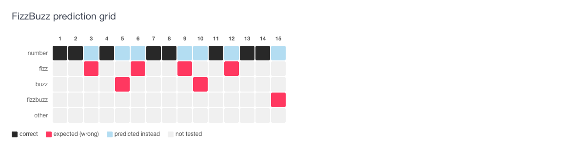
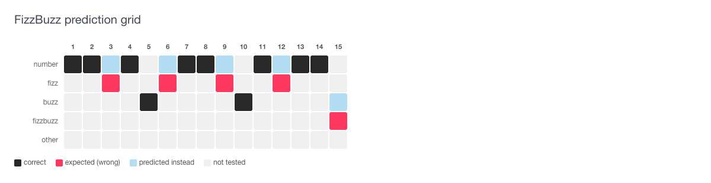
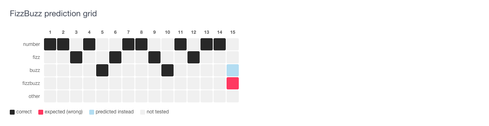
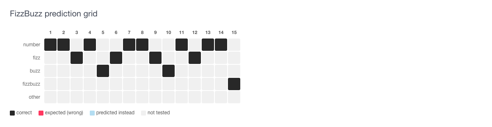

# TDD FizzBuzz — hill climb

Four iterations of a Ruby FizzBuzz implementation, seeded as eval run data and
rendered through the eval grid. Each iteration adds exactly the logic needed to
pass the next failing test, making the hill-climbing visible in the grid.

**Inputs:** 1–15  
**Grid rows:** number, fizz, buzz, fizzbuzz, other  
**Grid columns:** one cell per input  
**Colors:** black = correct, red = expected (wrong), blue = predicted instead, gray = not tested

---

## Iteration 1 — base: `n.to_s` (8/15)

```ruby
def fizzbuzz(n)
  n.to_s
end
```

Returns the number as a string for every input. Plain numbers pass; all fizz,
buzz, and fizzbuzz cells are red — no rules have been written yet.



---

## Iteration 2 — add Buzz for `n % 5 == 0` (10/15)

```ruby
def fizzbuzz(n)
  return "Buzz" if n % 5 == 0
  n.to_s
end
```

Adds the first conditional: multiples of 5 now return "Buzz". Columns 5 and 10
turn black. Column 15 still fails — it hits the `% 5` branch and returns "Buzz"
instead of "FizzBuzz".



---

## Iteration 3 — add Fizz for `n % 3 == 0` (14/15)

```ruby
def fizzbuzz(n)
  return "Buzz" if n % 5 == 0
  return "Fizz" if n % 3 == 0
  n.to_s
end
```

The Fizz hill is climbed: columns 3, 6, 9, and 12 all turn black. One red cell
remains — column 15 still short-circuits at `% 5` and returns "Buzz".



---

## Iteration 4 — add FizzBuzz for `n % 15 == 0` (15/15)

```ruby
def fizzbuzz(n)
  return "FizzBuzz" if n % 15 == 0
  return "Buzz" if n % 5 == 0
  return "Fizz" if n % 3 == 0
  n.to_s
end
```

The FizzBuzz check is placed first so that multiples of both 3 and 5 are caught
before either individual branch. All 15 cells are now black — the hill is fully
climbed.


