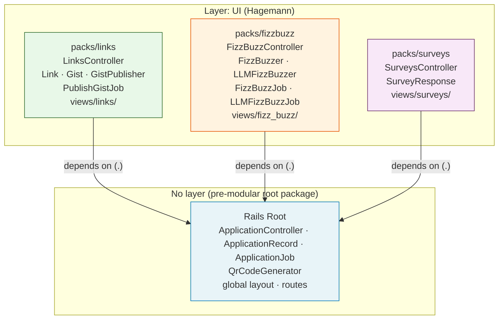

# Plan: Create packs/links and packs/fizzbuzz

**Decision:** Move domain files (source + tests) into packs using `git mv`.
Resolve the one cross-domain dependency by keeping `QrCodeGenerator` at root.
Tests move with their domain. Fixtures, cassettes, and evals infrastructure
stay at root.

**Rationale:** No source-code constant changes are needed because Zeitwerk adds
each `packs/*/app/<layer>/` directory as an autoload root. Tests move to
co-locate ownership but do not affect Packwerk boundary enforcement (Packwerk
ignores test files). `QrCodeGenerator` stays at root because it's a generic
utility used by both domains.

See: [directory-layout.md](../research/pack-conventions/directory-layout.md),
[file-movement-strategy.md](../research/migration-path/file-movement-strategy.md),
[test-path-changes.md](../research/migration-path/test-path-changes.md),
[cross-domain-dependencies.md](../research/domain-inventory/cross-domain-dependencies.md)

---

## Pack Dependency Diagram

The intended dependency graph after this plan completes:



**Key properties:**
- No inter-pack dependencies (fizzbuzz ↔ links)
- Both `UI`-layer packs depend only on root (which has no layer — exempt from layer enforcement)
- Root has no layer declaration: it contains `app`-layer concerns (global nav, layouts) mixed with `utility`-layer concerns (base classes); those will separate as modularization deepens
- `enforce_layers: true` on UI packs catches future violations if a `data` or `utility` pack incorrectly depends back up on a `UI` pack

---

## Steps

### Step A: Resolve the cross-domain dependency

`QrCodeGenerator` is already at `app/models/qr_code_generator.rb` — it
**stays there**. When `packs/links` is created without `qr_code_generator.rb`,
that file remains in the root package and is accessible to all packs (root has
`enforce_privacy: false`).

Verify both views reference it cleanly:
```sh
grep -r "QrCodeGenerator" app/views/fizz_buzz/  # found in _survey_qr.html.erb
grep -r "QrCodeGenerator" app/views/links/       # found in _qr_code.html.erb
```

No code changes needed.

### Step B: Create packs/links

#### B0 — Update test/test_helper.rb to support pack fixtures

Add pack fixture directories to Rails' fixture search path. Edit `test/test_helper.rb` and add after the `fixtures :all` line:

```ruby
# Include fixtures from all pack test directories
ActiveRecord::FixtureSet.fixture_paths = [
  Rails.root.join("test/fixtures").to_s,
  *Dir[Rails.root.join("packs/*/test/fixtures")]
]
```

This change only needs to be made once (here in Step B); it covers all three packs.

Also update the VCR configuration in `test/test_helper.rb` to resolve cassettes relative to the Rails root so pack-relative paths work:

```ruby
VCR.configure do |config|
  config.cassette_library_dir = Rails.root.to_s   # was "test/cassettes"
  # cassette names in tests now use full relative paths, e.g.:
  #   "packs/links/test/cassettes/gist_publisher_create"
  #   "packs/fizzbuzz/test/cassettes/fizzbuzz_basic_01"
  ...
end
```

Commit this change with the Step B5 commit or separately:
```sh
git add test/test_helper.rb
git commit -m "test: update fixture_paths and VCR cassette_library_dir to support per-pack test directories"
```

#### B1 — Move source files

```sh
mkdir -p packs/links/app/{controllers,jobs,models,views}

git mv app/controllers/links_controller.rb  packs/links/app/controllers/
git mv app/jobs/publish_gist_job.rb         packs/links/app/jobs/
git mv app/models/link.rb                   packs/links/app/models/
git mv app/models/gist.rb                   packs/links/app/models/
git mv app/models/gist_publisher.rb         packs/links/app/models/
git mv app/views/links                      packs/links/app/views/
```

#### B2 — Move tests

```sh
mkdir -p packs/links/test/{controllers,jobs,models,system}

git mv test/controllers/links_controller_test.rb  packs/links/test/controllers/
git mv test/jobs/publish_gist_job_test.rb         packs/links/test/jobs/
git mv test/models/link_test.rb                   packs/links/test/models/
git mv test/models/gist_test.rb                   packs/links/test/models/
git mv test/models/gist_publisher_test.rb         packs/links/test/models/
git mv test/models/qr_code_generator_test.rb      packs/links/test/models/
git mv test/system/links_test.rb                  packs/links/test/system/
```

Update `require` lines in moved test files. Change any `require_relative`
paths that reference `test_helper` to:
```ruby
require "test_helper"
```

Rails adds `test/` to the load path during test runs, so `require "test_helper"`
resolves regardless of the test file's location.

#### B2a — Move fixtures

```sh
mkdir -p packs/links/test/fixtures
git mv test/fixtures/links.yml packs/links/test/fixtures/
```

#### B2b — Move VCR cassettes

```sh
mkdir -p packs/links/test/cassettes
git mv test/cassettes/gist_publisher_*.yml packs/links/test/cassettes/
```

Update cassette names in `packs/links/test/jobs/publish_gist_job_test.rb` — prefix each
`VCR.use_cassette` name with `"packs/links/test/cassettes/"`:

```ruby
# Before
VCR.use_cassette("gist_publisher_create") { ... }

# After
VCR.use_cassette("packs/links/test/cassettes/gist_publisher_create") { ... }
```

#### B3 — Add package.yml

```yaml
# packs/links/package.yml
enforce_dependencies: true
enforce_privacy: true
enforce_layers: true
layer: UI
dependencies:
  - "."
```

#### B4 — Verify

```sh
bin/rails zeitwerk:check
bin/rails test
bin/packwerk validate
bin/packwerk check
```

Expected: all green, zero violations.

#### B5 — Commit

```sh
git add packs/links/ app/ test/fixtures/ test/cassettes/
git commit -m "refactor: create packs/links — move models, controller, job, views, and tests"
```

---

### Step C: Create packs/fizzbuzz

#### C1 — Move source files

```sh
mkdir -p packs/fizzbuzz/app/{controllers,helpers/ruby_llm/evals,jobs,models,views}

git mv app/controllers/fizz_buzz_controller.rb   packs/fizzbuzz/app/controllers/
git mv app/jobs/fizz_buzz_job.rb                 packs/fizzbuzz/app/jobs/
git mv app/jobs/llm_fizz_buzz_job.rb             packs/fizzbuzz/app/jobs/
git mv app/models/fizz_buzzer.rb                 packs/fizzbuzz/app/models/
git mv app/models/llm_fizz_buzzer.rb             packs/fizzbuzz/app/models/
git mv app/views/fizz_buzz                       packs/fizzbuzz/app/views/
git mv app/helpers/ruby_llm/evals/runs_helper.rb packs/fizzbuzz/app/helpers/ruby_llm/evals/
```

#### C2 — Move tests

```sh
mkdir -p packs/fizzbuzz/test/{controllers,jobs,models,system}

git mv test/controllers/fizz_buzz_controller_test.rb  packs/fizzbuzz/test/controllers/
git mv test/jobs/fizz_buzz_job_test.rb                packs/fizzbuzz/test/jobs/
git mv test/jobs/llm_fizz_buzz_job_test.rb            packs/fizzbuzz/test/jobs/
git mv test/models/fizz_buzzer_test.rb                packs/fizzbuzz/test/models/
git mv test/models/llm_fizz_buzzer_test.rb            packs/fizzbuzz/test/models/
git mv test/system/fizz_buzz_test.rb                  packs/fizzbuzz/test/system/
```

Update `require "test_helper"` as in Step B2.

Note: `test/evals/` tests, `test/helpers/`, `test/configuration/`, and
`test/support/` stay at root — see [test-path-changes.md](../research/migration-path/test-path-changes.md).

#### C2a — Move fixtures

```sh
mkdir -p packs/fizzbuzz/test/fixtures/ruby_llm/evals
git mv test/fixtures/ruby_llm/ packs/fizzbuzz/test/fixtures/ruby_llm/
```

#### C2b — Move VCR cassettes

```sh
mkdir -p packs/fizzbuzz/test/cassettes
git mv test/cassettes/fizzbuzz_basic_*.yml       packs/fizzbuzz/test/cassettes/
git mv test/cassettes/fizzbuzz_basic_v*_*.yml    packs/fizzbuzz/test/cassettes/
git mv test/cassettes/fizzbuzz_clean_*.yml       packs/fizzbuzz/test/cassettes/
git mv test/cassettes/fizzbuzz_eval_*.yml        packs/fizzbuzz/test/cassettes/
git mv test/cassettes/yoda_fizzbuzz_*.yml        packs/fizzbuzz/test/cassettes/
git mv test/cassettes/execute_sample_job_*.yml   packs/fizzbuzz/test/cassettes/
```

Update cassette names in each moved eval test file — prefix with `"packs/fizzbuzz/test/cassettes/"`.
The `with_eval_cassette` helper in `EvalTestSetup` handles cassette naming for eval tests; update
its cassette name construction to prepend `"packs/fizzbuzz/test/cassettes/"`.

#### C3 — Add package.yml

```yaml
# packs/fizzbuzz/package.yml
enforce_dependencies: true
enforce_privacy: true
enforce_layers: true
layer: UI
dependencies:
  - "."
```

#### C4 — Verify

```sh
bin/rails zeitwerk:check
bin/rails test
bin/packwerk validate
bin/packwerk check
```

Expected: all green, zero violations.

#### C5 — Commit

```sh
git add packs/fizzbuzz/ app/ test/fixtures/ test/cassettes/
git commit -m "refactor: create packs/fizzbuzz — move models, controllers, jobs, views, and tests"
```

---

### Step D: Create packs/surveys

#### D1 — Move source files

```sh
mkdir -p packs/surveys/app/{controllers,models,views}

git mv app/controllers/surveys_controller.rb  packs/surveys/app/controllers/
git mv app/models/survey_response.rb          packs/surveys/app/models/
git mv app/views/surveys                      packs/surveys/app/views/
```

#### D2 — Move tests

```sh
mkdir -p packs/surveys/test/{controllers,system}

git mv test/controllers/surveys_controller_test.rb  packs/surveys/test/controllers/
git mv test/system/surveys_test.rb                  packs/surveys/test/system/
```

Update `require "test_helper"` as in Step B2.

#### D2a — Move fixtures

```sh
mkdir -p packs/surveys/test/fixtures
# Move survey fixtures if they exist (e.g. survey_responses.yml):
git mv test/fixtures/survey_responses.yml packs/surveys/test/fixtures/ 2>/dev/null || true
```

Note: If no survey-specific fixtures exist at `test/fixtures/`, skip this step.

#### D2b — Move VCR cassettes

```sh
mkdir -p packs/surveys/test/cassettes
git mv test/cassettes/*_negative.yml packs/surveys/test/cassettes/
git mv test/cassettes/*_positive.yml packs/surveys/test/cassettes/
```

Update cassette names in `packs/surveys/test/` test files — prefix with `"packs/surveys/test/cassettes/"`.

#### D3 — Add package.yml

```yaml
# packs/surveys/package.yml
enforce_dependencies: true
enforce_privacy: true
enforce_layers: true
layer: UI
dependencies:
  - "."
```

#### D4 — Verify

```sh
bin/rails zeitwerk:check
bin/rails test
bin/packwerk validate
bin/packwerk check
```

Expected: all green, zero violations.

Note: Route helpers referenced in `packs/fizzbuzz` views (`survey_path`, `survey_url`,
`results_survey_path`) are NOT Packwerk violations — route helpers are always shared
app-wide regardless of pack boundaries.

#### D5 — Commit

```sh
git add packs/surveys/ app/ test/fixtures/ test/cassettes/
git commit -m "refactor: create packs/surveys — move SurveyResponse, SurveysController, and views"
```

---

## Files That Move

### packs/links (source)

| From | To |
|------|----|
| `app/controllers/links_controller.rb` | `packs/links/app/controllers/` |
| `app/jobs/publish_gist_job.rb` | `packs/links/app/jobs/` |
| `app/models/link.rb` | `packs/links/app/models/` |
| `app/models/gist.rb` | `packs/links/app/models/` |
| `app/models/gist_publisher.rb` | `packs/links/app/models/` |
| `app/views/links/` | `packs/links/app/views/links/` |

### packs/links (tests)

| From | To |
|------|----|
| `test/controllers/links_controller_test.rb` | `packs/links/test/controllers/` |
| `test/jobs/publish_gist_job_test.rb` | `packs/links/test/jobs/` |
| `test/models/link_test.rb` | `packs/links/test/models/` |
| `test/models/gist_test.rb` | `packs/links/test/models/` |
| `test/models/gist_publisher_test.rb` | `packs/links/test/models/` |
| `test/models/qr_code_generator_test.rb` | `packs/links/test/models/` |
| `test/system/links_test.rb` | `packs/links/test/system/` |

### packs/fizzbuzz (source)

| From | To |
|------|----|
| `app/controllers/fizz_buzz_controller.rb` | `packs/fizzbuzz/app/controllers/` |
| `app/jobs/fizz_buzz_job.rb` | `packs/fizzbuzz/app/jobs/` |
| `app/jobs/llm_fizz_buzz_job.rb` | `packs/fizzbuzz/app/jobs/` |
| `app/models/fizz_buzzer.rb` | `packs/fizzbuzz/app/models/` |
| `app/models/llm_fizz_buzzer.rb` | `packs/fizzbuzz/app/models/` |
| `app/views/fizz_buzz/` | `packs/fizzbuzz/app/views/fizz_buzz/` |
| `app/helpers/ruby_llm/evals/runs_helper.rb` | `packs/fizzbuzz/app/helpers/ruby_llm/evals/` |

### packs/fizzbuzz (tests)

| From | To |
|------|----|
| `test/controllers/fizz_buzz_controller_test.rb` | `packs/fizzbuzz/test/controllers/` |
| `test/jobs/fizz_buzz_job_test.rb` | `packs/fizzbuzz/test/jobs/` |
| `test/jobs/llm_fizz_buzz_job_test.rb` | `packs/fizzbuzz/test/jobs/` |
| `test/models/fizz_buzzer_test.rb` | `packs/fizzbuzz/test/models/` |
| `test/models/llm_fizz_buzzer_test.rb` | `packs/fizzbuzz/test/models/` |
| `test/system/fizz_buzz_test.rb` | `packs/fizzbuzz/test/system/` |

### packs/surveys (source)

| From | To |
|------|----|
| `app/controllers/surveys_controller.rb` | `packs/surveys/app/controllers/` |
| `app/models/survey_response.rb` | `packs/surveys/app/models/` |
| `app/views/surveys/` | `packs/surveys/app/views/surveys/` |

### packs/surveys (tests)

| From | To |
|------|----|
| `test/controllers/surveys_controller_test.rb` | `packs/surveys/test/controllers/` |
| `test/system/surveys_test.rb` | `packs/surveys/test/system/` |

### Stays at Root

| File | Reason |
|------|--------|
| `app/models/qr_code_generator.rb` | Shared utility (both domains use it) |
| `test/evals/`, `test/support/`, `test/helpers/` | Complex path dependencies |
| `test/cassettes/` | Per-pack cassettes moved to `packs/<name>/test/cassettes/`; directory empty after migration |
| `test/fixtures/` | Per-pack fixtures moved to `packs/<name>/test/fixtures/`; `test/fixtures/files/.keep` stays |

---

## Open Questions

1. **Engine views**: `app/views/ruby_llm/evals/runs/` — verify that moving
   these to `packs/fizzbuzz/app/views/ruby_llm/evals/runs/` doesn't break the
   engine's view resolution. Test by visiting `/evals` after the move. If
   broken, keep those views at root.

2. **runs_helper.rb**: After moving to the fizzbuzz pack, confirm the constant
   `RubyLLM::Evals::RunsHelper` is still found by running the helper tests.

## Verification

- `bin/rails zeitwerk:check` exits 0 after each step
- `bin/rails test` passes after each step (all test types: unit, controller, system)
- `bin/packwerk validate` exits 0 after each step
- `bin/packwerk check` exits 0 with "No violations detected." after each step
- `bin/rails test packs/surveys/test/` passes
- `packs/surveys/package.yml` has `enforce_dependencies: true`, `enforce_privacy: true`, `enforce_layers: true`
