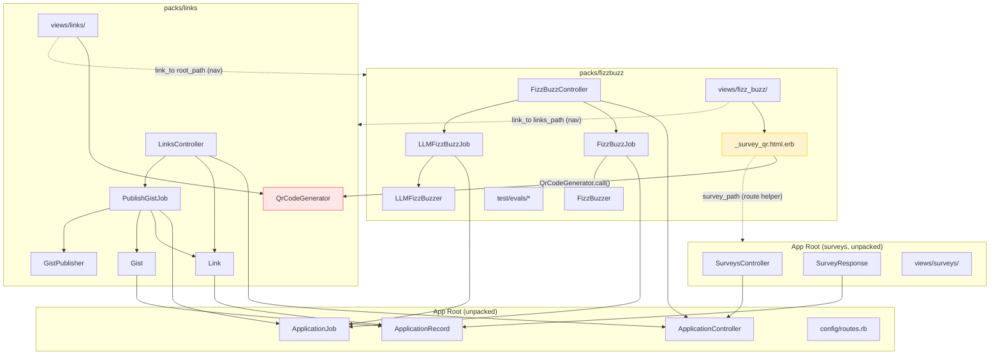

# Cross-Domain Dependencies

Analysis of references between the fizzbuzz, links, and surveys domains.

---

## Summary

There is **one cross-domain reference** within the target packs, plus a set of
**navigation links** in views that cross domains. There are no Ruby code
cross-references between the fizzbuzz and links domains.

---

## Cross-Domain References Table

| Source File | References | Target Domain | Notes |
|-------------|-----------|---------------|-------|
| `app/views/fizz_buzz/_survey_qr.html.erb` | `QrCodeGenerator.call(survey_url)` | links | Calls `QrCodeGenerator` (links-domain service) to generate a QR code for the survey URL. This is the only Ruby class cross-reference between fizzbuzz and links. |
| `app/views/fizz_buzz/_survey_qr.html.erb` | `survey_path`, `survey_url`, `results_survey_path` | surveys | Uses survey route helpers. Fizzbuzz view renders a QR code linking to the survey. |
| `app/views/fizz_buzz/start.html.erb` | `<%= render "survey_qr" %>` | fizzbuzz→surveys (indirect) | Renders `_survey_qr.html.erb` which has the cross-domain references above. |
| `app/views/fizz_buzz/start.html.erb` | `link_to "Links →", links_path` | links | Navigation link to links index. Not a pack dependency violation (route helpers are always shared). |
| `app/views/links/index.html.erb` | `link_to "← FizzBuzz", root_path` | fizzbuzz | Navigation link back to fizzbuzz root. Not a pack dependency violation. |

---

## Detailed Analysis

### Does FizzBuzz reference Link/Gist/Survey classes?

- **Ruby code**: No. `FizzBuzzController`, `FizzBuzzJob`, `LLMFizzBuzzJob`, `FizzBuzzer`, and `LLMFizzBuzzer` make no reference to `Link`, `Gist`, `GistPublisher`, `QrCodeGenerator`, or `SurveyResponse`.
- **Views**: Yes — `app/views/fizz_buzz/_survey_qr.html.erb` calls `QrCodeGenerator.call(survey_url)`. This is a direct Ruby class reference to the links domain.

### Does Links reference FizzBuzz/Survey classes?

- **Ruby code**: No. `LinksController`, `PublishGistJob`, `Link`, `Gist`, `GistPublisher`, and `QrCodeGenerator` make no reference to any fizzbuzz or survey class.
- **Views**: No class references. `links/index.html.erb` has a navigation link to `root_path` (fizzbuzz), but route helpers are not considered Packwerk dependency violations.

### Does PublishGistJob reference anything outside the links domain?

No. `PublishGistJob` uses only: `GistPublisher`, `Link`, `Gist`, and Rails infrastructure (`ApplicationJob`, `Turbo::StreamsChannel`). It is cleanly contained within the links domain.

### Do the fizz_buzz views embed any surveys/links partials?

- `app/views/fizz_buzz/_survey_qr.html.erb` references `QrCodeGenerator` (links) and survey routes. It does **not** render a surveys or links partial — it calls the links service directly.
- `app/views/fizz_buzz/start.html.erb` renders `survey_qr` (a local fizzbuzz partial) and links to `links_path` via a navigation anchor.

### Does the surveys domain reference either links or fizzbuzz?

No. `SurveysController`, `SurveyResponse`, and all surveys views reference only their own domain and Rails infrastructure. No references to `Link`, `Gist`, `FizzBuzzer`, `FizzBuzzJob`, etc.

---

## Mermaid Dependency Diagram

**Legend:**
- Solid arrows: Ruby class/method references (Packwerk-enforced dependencies)
- Dashed arrows: Route helper usage or navigation links (not Packwerk violations)
- Yellow highlight: The cross-domain caller (`_survey_qr.html.erb`)
- Red highlight: The cross-domain callee (`QrCodeGenerator`)

---

## Impact on Pack Creation

The single cross-domain dependency (`_survey_qr.html.erb` calling `QrCodeGenerator`) must be resolved before Packwerk strict mode can be enforced. Options:

1. **Declare a public API**: Mark `QrCodeGenerator` as part of `packs/links`'s public interface and add `packs/fizzbuzz` as a permitted dependent of `packs/links` in `package.yml`.
2. **Move `QrCodeGenerator` to root**: Treat it as shared infrastructure since it is also used in `links/_qr_code.html.erb`.
3. **Duplicate or extract**: Create a lightweight `SurveyQrCodeGenerator` in the fizzbuzz pack that replicates the SVG generation logic.

Option 1 is the lowest-friction path. Option 2 is clean if QR code generation is considered a generic utility.

The route-helper references (`survey_path`, `links_path`, `root_path`) are **not** Packwerk violations — routes are always shared app-wide.
