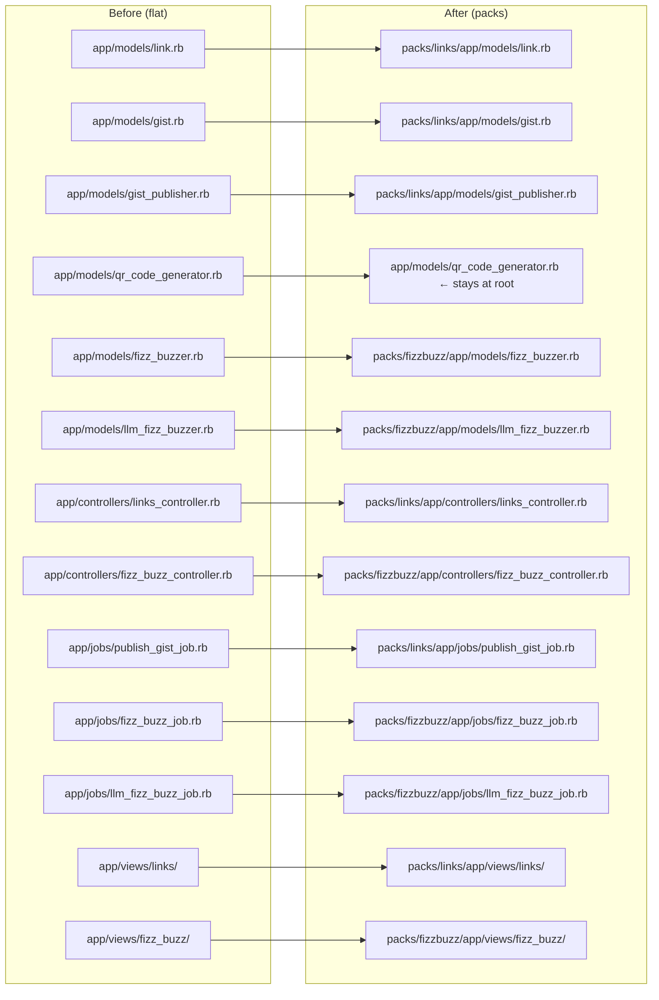

# File Movement Strategy

## Do Source Files Need Changes?

**No.** When Zeitwerk is configured correctly, moving a file from
`app/models/link.rb` to `packs/links/app/models/link.rb` requires no changes
to the file itself. The constant name `Link` is determined by the path relative
to the autoload root — and the autoload root shifts from `app/models/` to
`packs/links/app/models/`.

Files that reference `Link`, `FizzBuzzer`, `LinksController`, etc. also require
no changes — the constant name in calling code stays the same.

## Required config/application.rb Changes

Two additions needed before moving any files:

```ruby
# 1. Zeitwerk: autoload Ruby files from all packs
config.paths.add "packs", glob: "*/app/{*,*/concerns}", eager_load: true

# 2. ActionView: find templates from all pack view directories
config.paths["app/views"] += Dir[root.join("packs/*/app/views")]
```

Add both lines, then verify with:

```sh
bin/rails zeitwerk:check
bin/rails routes                # sanity check app boots
```

## QrCodeGenerator — Cross-Domain Resolution

`_survey_qr.html.erb` (a fizzbuzz view) calls `QrCodeGenerator.call(url)`,
which is currently an `app/models/` file classified as a links-domain concern.
This creates a cross-domain dependency.

**Resolution: move `QrCodeGenerator` to app root.**

`QrCodeGenerator` wraps the `rqrcode` gem — it has no knowledge of links or
bookmarks. It is a generic utility consumed by two domains. Keeping it at
`app/models/qr_code_generator.rb` (outside any pack) makes it shared
infrastructure, eliminating the cross-domain violation with no behavior change.

## Directory Structure Before → After



## Files That Stay at Root

| File | Reason |
|------|--------|
| `app/models/application_record.rb` | Base class for all models |
| `app/models/qr_code_generator.rb` | Shared utility (see above) |
| `app/models/survey_response.rb` | Surveys domain (not packed this issue) |
| `app/controllers/application_controller.rb` | Base class for all controllers |
| `app/controllers/surveys_controller.rb` | Surveys domain (not packed this issue) |
| `app/jobs/application_job.rb` | Base class for all jobs |
| `app/views/layouts/` | Shared layout |
| `app/views/surveys/` | Surveys domain (not packed this issue) |
| `config/routes.rb` | Rails convention — single routes file |
| `config/application.rb` | Rails app bootstrap |

## Atomic Commit Order

1. `feat: add packwerk gem, packwerk.yml, root package.yml, bin/packwerk`
2. `feat: configure autoload and view paths for packs/`
3. `refactor: move QrCodeGenerator to app root (shared utility)`
4. `refactor: create packs/links — move models, controller, job, views`
5. `feat: add packs/links/package.yml with enforcement on`
6. `refactor: create packs/fizzbuzz — move models, controllers, jobs, views`
7. `feat: add packs/fizzbuzz/package.yml with enforcement on`

After each commit: `bin/packwerk check && bin/rails test` to confirm no regressions.

## app/helpers/ruby_llm Consideration

`app/helpers/ruby_llm/evals/runs_helper.rb` belongs to the fizzbuzz/evals
domain. However, this is an engine helper loaded by the `ruby_llm-evals` gem
via its Engine. Moving it into a pack would require the engine to find it via
the pack's view paths — which ActionView does support if the pack view path is
registered.

**Recommendation:** Move `app/helpers/ruby_llm/evals/runs_helper.rb` to
`packs/fizzbuzz/app/helpers/ruby_llm/evals/runs_helper.rb`. The constant
`RubyLLM::Evals::RunsHelper` will be found via Zeitwerk's pack autoload paths.
