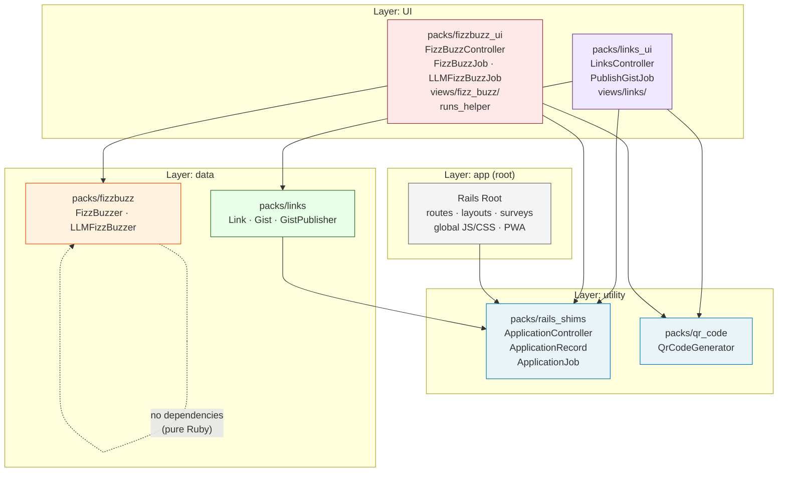

# Layer Architecture

Research based on Stephan Hagemann's *Gradual Modularization for Ruby and
Rails* (sportsball example, chapters 4–9) and the packwerk-extensions gem.

## The Four Layers

```yaml
# packwerk.yml
layers:
  - app       # global nav, layouts, application wiring (root package)
  - UI        # user-facing feature packs: controllers + views
  - data      # domain model packs: business logic and persistence
  - utility   # shared tools with no domain knowledge
```

The `layers:` field (not the deprecated `architecture_layers:`) is the current
packwerk-extensions name. Layers are listed highest → lowest. A pack may depend
on packs in the same or lower layers.

**Configuration:**
```yaml
# packwerk.yml
require:
  - packwerk-extensions   # loads all checkers including layer
layers:
  - app
  - UI
  - data
  - utility
```

```yaml
# package.yml (any pack)
enforce_layers: true
layer: UI   # or app / data / utility
```

## How Sportsball Applies This

From chapter 9 (the most evolved version), Sportsball splits each domain into
two packs:

| Pack | Layer | Contents |
|------|-------|----------|
| `packs/rails_shims` | utility | ApplicationController, ApplicationRecord, ApplicationJob, ApplicationMailer |
| `packs/predictor_interface` | utility | Generic predictor interface (pure Ruby, public API only) |
| `packs/teams` | data | Team ActiveRecord model only |
| `packs/games` | data | Game ActiveRecord model only |
| `packs/teams_admin` | UI | TeamsController + all teams views |
| `packs/games_admin` | UI | GamesController + all games views |
| `packs/prediction_ui` | UI | Prediction controllers + views |
| `packs/welcome_ui` | UI | Welcome page controllers + views |
| root | app | layouts, global assets, routes |

**The critical enabler: `rails_shims`.**
By extracting ApplicationController, ApplicationRecord, and ApplicationJob into
a `utility` pack, the root can be a proper `app` layer that depends only on
`rails_shims` for its own remaining base-class needs — and doesn't have to be
the implicit dependency of every other pack.

**Dependency flow:**
```
UI packs     → data packs + rails_shims + utility packs
data packs   → rails_shims + other data packs (if needed)
root (app)   → rails_shims (for surveys at root) + selected UI packs (optional)
utility packs → nothing
```

## fizzbuzz_app — Proposed Layer Map

Applying the sportsball model to fizzbuzz_app produces 6 packs:

| Pack | Layer | Contents |
|------|-------|----------|
| `packs/rails_shims` | utility | ApplicationController, ApplicationRecord, ApplicationJob |
| `packs/qr_code` | utility | QrCodeGenerator |
| `packs/links` | data | Link, Gist, GistPublisher |
| `packs/fizzbuzz` | data | FizzBuzzer, LLMFizzBuzzer |
| `packs/links_ui` | UI | LinksController, PublishGistJob, views/links/ |
| `packs/fizzbuzz_ui` | UI | FizzBuzzController, FizzBuzzJob, LLMFizzBuzzJob, views/fizz_buzz/, runs_helper |
| root | app | routes, layouts, surveys domain, global JS/CSS |

### Dependency graph



## FizzBuzzer — data layer without ActiveRecord

`FizzBuzzer` and `LLMFizzBuzzer` are plain Ruby objects (no ActiveRecord). They
still belong in the `data` layer because they are the core domain logic that UI
packs (controllers, jobs) depend on. This matches sportsball's `predictor_interface`
(also pure Ruby, also `utility` layer — though `data` is arguably more accurate
for non-generic domain logic).

`packs/fizzbuzz` has **no dependencies**: `FizzBuzzer` and `LLMFizzBuzzer` don't
inherit from ApplicationRecord and don't reference any other pack. This makes
`packs/fizzbuzz` the simplest pack in the system.

## QrCodeGenerator — utility layer

`QrCodeGenerator` wraps the `rqrcode` gem and has no domain knowledge —
it takes a URL string and returns an SVG. Both `links_ui` (via `_qr_code.html.erb`)
and `fizzbuzz_ui` (via `_survey_qr.html.erb`) use it. Moving it to `packs/qr_code`
(utility) means both UI packs can declare a clean dependency on it without any
cross-domain coupling.

## Evals — where do they go?

The `ruby_llm-evals` infrastructure (engine mounted at `/evals`, helper,
views, test fixtures) sits at the intersection of fizzbuzz domain and
evaluation framework. For this issue:

- `app/helpers/ruby_llm/evals/runs_helper.rb` → `packs/fizzbuzz_ui` (it is a
  UI helper for rendering eval results, fizzbuzz-specific)
- `app/views/ruby_llm/evals/runs/` → `packs/fizzbuzz_ui` (evals views)
- `test/evals/` → stays at root (EvalTestSetup has root-relative paths)
- `evals/` data directory → stays at root (EvalLoader references root path)

The evals test infrastructure is not reorganized in this issue.

## Root Package in the Final State

Root (`app` layer) declares:

```yaml
# package.yml (root)
enforce_dependencies: true
enforce_privacy: false
enforce_layers: true
layer: app
dependencies:
  - packs/rails_shims   # for SurveysController < ApplicationController
                         # and SurveyResponse < ApplicationRecord
```

Root is lean: routes, global layout, surveys, JS/CSS. It no longer contains
ApplicationController or ApplicationRecord — those live in `packs/rails_shims`.

## What This Means for Issue #117 Scope

The full 6-pack split is the correct target architecture. Since no implementation
has started, the plans should aim for this directly rather than plan a stepping-stone
2-pack structure that would need to be re-done. The additional work (splitting each
domain into data + UI sub-packs, extracting rails_shims, extracting qr_code) is
bounded and manageable for this small app.
